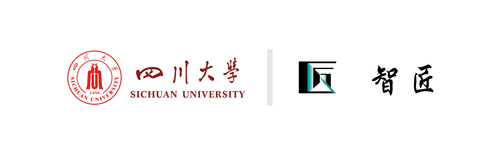

# **赛博简历团队 Readme**

1. #### **关于我们—About Us**

   **Logo:**

   ##### **介绍**

   我们是“赛博简历”团队，一支来自四川大学软件学院的队伍。我们的队员都是具有NLP算法研究以及项目开发经验的学生，同时积极投身于各种技术竞赛，并致力于将前沿的技术应用到实际问题之中。

   ##### 开发人员

   团队中的开发人员具有广泛的编程知识和技能，熟悉多种编程语言和开发框架。他们精通后端和前端开发，可以创建可靠的应用程序和直观的用户界面。他们还具备良好的项目管理能力，能够按时交付高质量的工作成果。

   ##### 算法开发人员

   团队中的的算法开发人员具备深厚的数学和NLP研究背景，擅长处理和分析大量的招聘数据。他们通过构建机器学习模型和算法来进行候选人信息获取以及评估。他们致力于不断改进系统的智能化水平，以提供更准确的推荐和评估结果。

   ##### 我们的价值观

   我们团队注重技术创新和解决问题的能力，相信通过持续学习和探索，可以不断提升系统的性能和功能，并满足客户的需求。任何对该项目感兴趣的个人或者团队想对我们提出意见，我们都欢迎你与我们联系。

   ##### Introduction

   We are the "Cyber Resume" team, a group from the School of Software Engineering at Sichuan University. Our team members are students with experience in NLP algorithm research and project development. We actively participate in various technical competitions and strive to apply cutting-edge technology to practical problems.

   ##### Developers

   The developers in our team have extensive programming knowledge and skills, familiar with multiple programming languages and development frameworks. They excel in both backend and frontend development, capable of creating reliable applications and intuitive user interfaces. They also possess excellent project management abilities, delivering high-quality work on time.

   ##### Algorithm Developers

   The algorithm developers in our team have a strong background in mathematics and NLP research, specializing in handling and analyzing large amounts of recruitment data. They utilize machine learning models and algorithms for candidate information retrieval and evaluation. They are dedicated to continuously improving the intelligence level of the system to provide more accurate recommendations and evaluations.

   ##### Our Values

   Our team values technological innovation and problem-solving abilities. We believe that through continuous learning and exploration, we can enhance the performance and functionality of the system while meeting customer needs. We welcome any individuals or teams interested in this project to reach out to us with their suggestions or feedback.